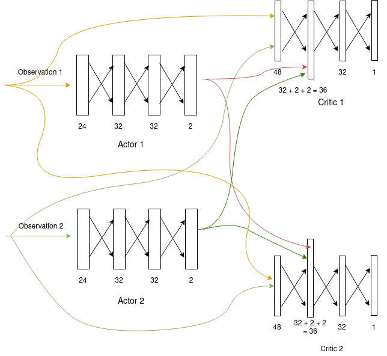
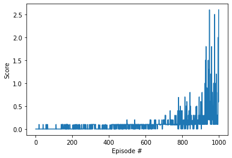

# Report: Collaboration and Competition

## Algorithm
MADDPG, or Multi-agent DDPG, extends DDPG into a multi-agent policy gradient algorithm where decentralized agents
learn a centralized critic based on the observations and actions of all agents. It leads to learned policies that
only use local information (i.e. their own observations) at execution time, does not assume a differentiable model
of the environment dynamics or any particular structure on the communication method between agents, and is applicable
not only to cooperative interaction but to competitive or mixed interaction involving both physical and communicative
behavior. The critic is augmented with extra information about the policies of other agents, while the actor only has
access to local information. After training is completed, only the local actors are used at execution phase, acting in
a decentralized manner.

### Hyperparameters
| Hyperparameter | Description                          | Value |
|----------------|--------------------------------------|-------|
| BUFFER_SIZE    | replay buffer size                   | 1e6   |
| BATCH_SIZE     | minibatch size                       | 128   |
| GAMMA          | discount factor                      | 0.99  |
| TAU            | for soft update of target parameters | 8e-3  |
| LR_ACTOR       | learning rate for the actor          | 3e-3  |
| LR_CRITIC      | learning rate for the critic         | 4e-4  |
| WEIGHT_DECAY   | L2 weight decay                      | 0     |
| mu             | OU Noise mu                          | 0     |
| theta          | OU Noise theta                       | 0.15  |
| sigma          | OU Noise sigma                       | 0.1   |

### Model architectures

- Actor

| Layer | Input      | Output      |
|-------|------------|-------------|
| fc1   | state_size | 32          |
| bn1   | 32         | 32          |
| fc2   | 32         | 32          |
| fc3   | 32         | action_size |

- Critic

| Layer | Input                | Output |
|-------|----------------------|--------|
| fc1   | 2 * state_size       | 32     |
| bn1   | 32                   | 32     |
| fc2   | 32 + 2 * action_size | 32     |
| fc3   | 32                   | 1      |

## Change Log/Timeline
1. Started with DDPG algorithm in Udacity's DRL repo for pendulum.
2. Updated DDPG to train critic according to MADDPG.
3. Took hyperparameters from MADDPG paper.
4. Started with hidden network 128 each for both actor and critic.
5. Reduce hidden network to 64 each.
   - Improvement in score
7. Reduced hidden network further to 32 each for both networks.
    - Solved in 1124 episodes!
8. Fixed agent `state_dict()` to be accessible from maddpg agent.
9. Rerun - solved in 998 episodes.

## Plot of Rewards

The agent took 998 episodes to solve the environment.

## Ideas for Future Work
- Try training with single Critic model, this should speedup the training.
- Try to implement two enhancements from the paper:
  1. Inferring Policies of Other Agents
  2. Agents with Policy Ensembles
